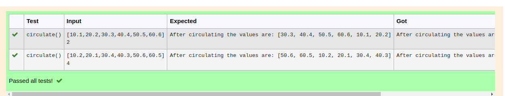

# Circulate-the-values-of-N-variables

## Aim:

To write a python program to circulate the n variables using function concept

## Equipment’s required:

PC
Anaconda - Python 3.7

## Algorithm: 

### Step 1: 
Import the math

### Step 2: 
get the input

### Step 3: 
Get the value from the user for the number of rotation

### Step 4: 
Using the slicing concept rotate the list

### Step 5: 
Print the value it would be interchanged

### Step 6: 
End the program

## Program:
```python
#Program to circulate N values.
#Developed by: S.Aishwarya
#RegisterNumber: 22008635
a=eval(input())
b=int(input())
def circulate():
    for n in range(b+1):
        c=a[n:]+a[:n]
    return c
print("After circulating the values are:",circulate())
```


## Output:


## Result:
Thus the circulation n variables is successfully executed
